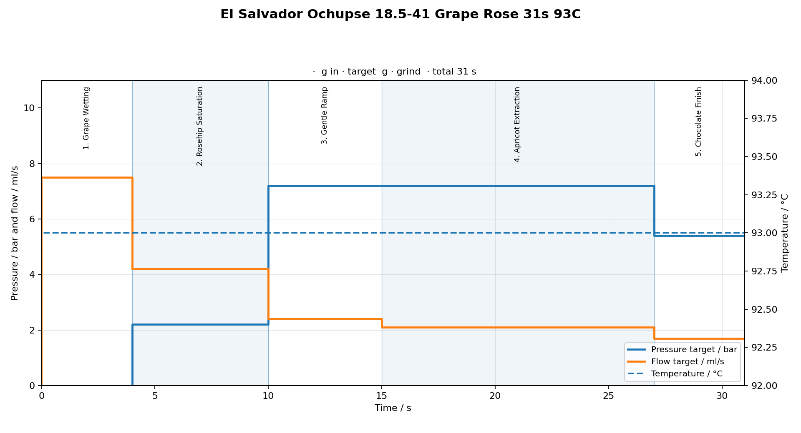
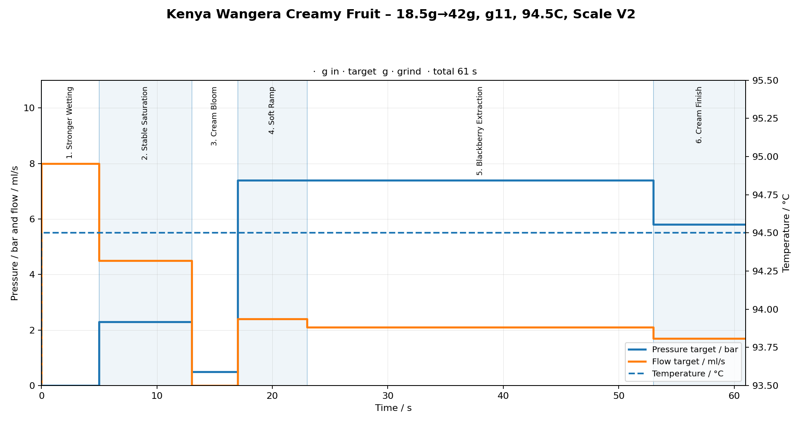
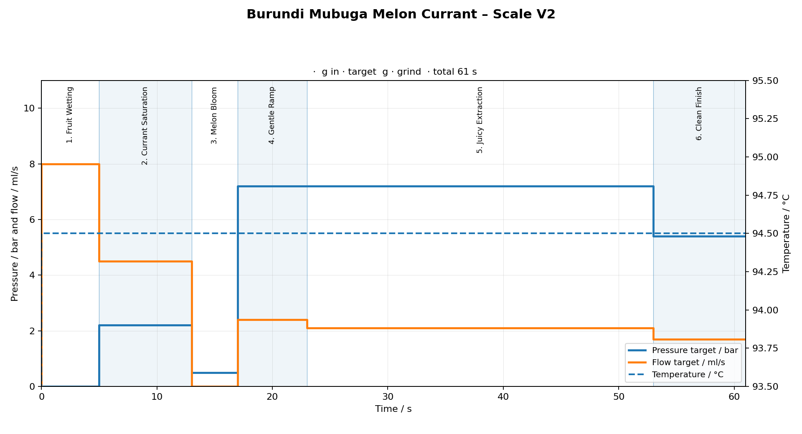
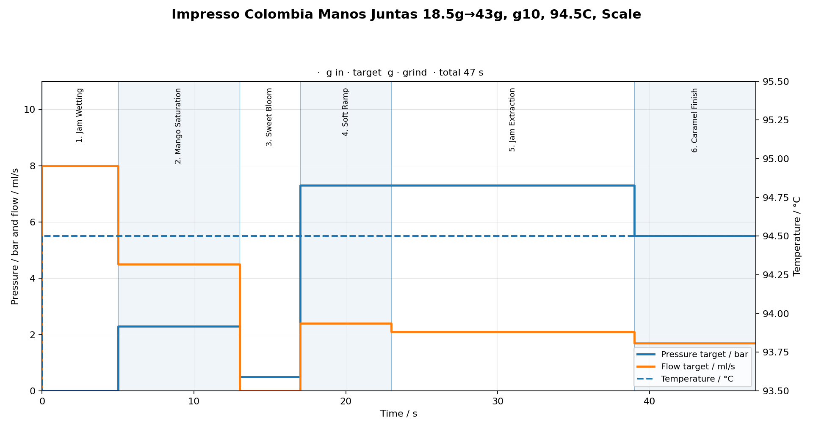
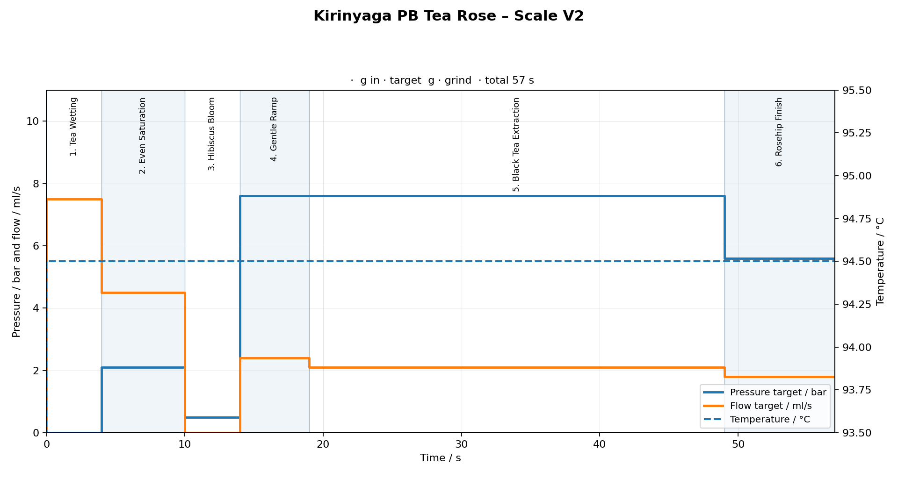
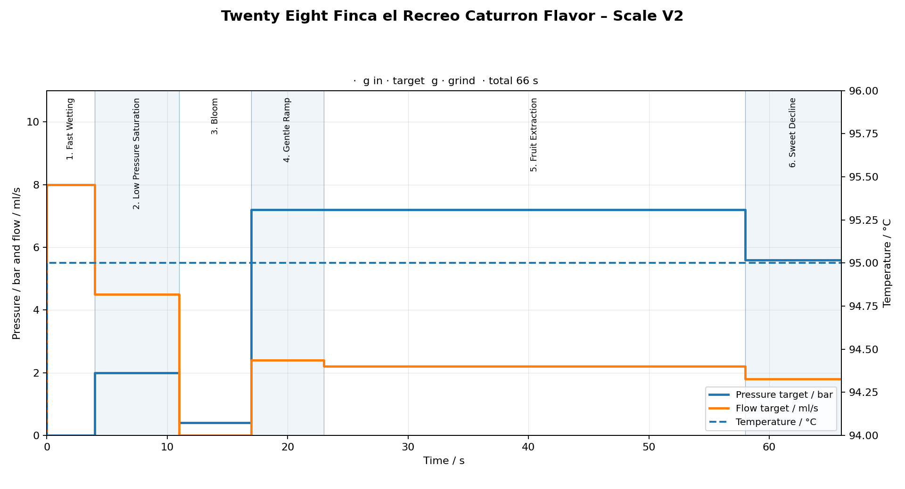
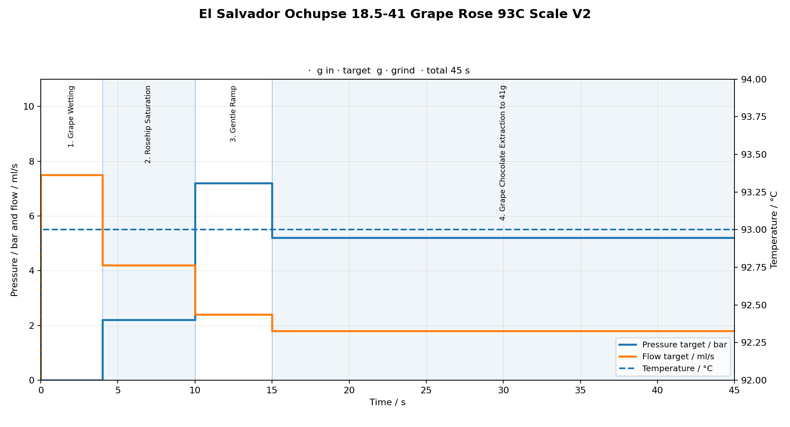
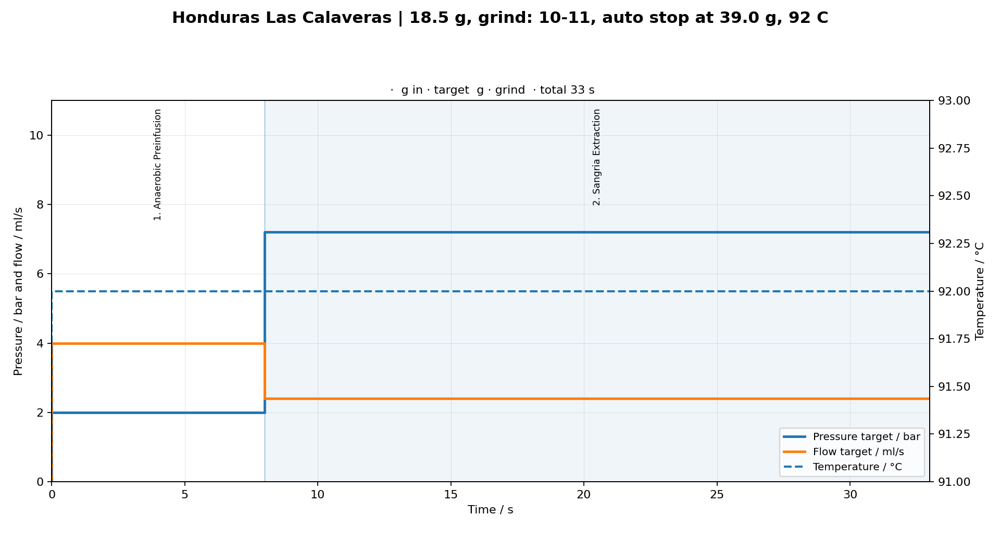

# Profile Gallery

## Általános célú profilok

### 9 Bar Espresso


### Cremina lever machine


### Damian's LM Leva


### Adaptive v2


---

## Time Based profilok (V1)

Ezek a profilok időalapúak. A shot a beállított másodpercig fut; a hozamot külön mérlegen kell figyelni.

### Wangera Stable Start 38s 94.5C – Time Based


### Burundi Mubuga Melon Currant 38s – Time Based


### Colombia Manos Juntas Jam Mango 39s – Time Based


### Kirinyaga PB Tea Rose 37s – Time Based


### Twenty Eight Finca el Recreo Caturron Flavor 42s – Time Based


### El Salvador Ochupse Grape Rose 31s 93C – Time Based



---

## Bluetooth Scale Edition profilok (V2)

Ezek a profilok BOOKOO Themis Ultra Bluetooth mérleggel automatikusan megállnak a céltömegnél. A grafikonok a fázis/nyomás/flow értékeket mutatják – a tényleges shot hossza a mérleg stopjától függ.

### Wangera Stable Start 94.5C – Scale V2



### Wangera Stable Start 94.0C – Scale V2


### Burundi Mubuga Melon Currant – Scale V2



### Colombia Manos Juntas Jam Mango – Scale V2



### Kirinyaga PB Tea Rose – Scale V2



### Twenty Eight Finca el Recreo Caturron Flavor – Scale V2



### El Salvador Ochupse Grape Rose – Scale V2



### Honduras Las Calaveras – Scale V2



---

## Megjegyzés a V2 grafikonokhoz

A V2 Scale Edition grafikonokat a `tools/render_profiles.py` script generálja a `*-scale-v2.json` fájlokból:

```bash
python3 tools/render_profiles.py
```

A V2 grafikonok az időalapú V1 grafikonokhoz hasonlók (azonos fázis/nyomás/flow értékek), de a fázisok duration értékei hosszabbak, mivel a tényleges shot stop a mérleg által vezérelt.
