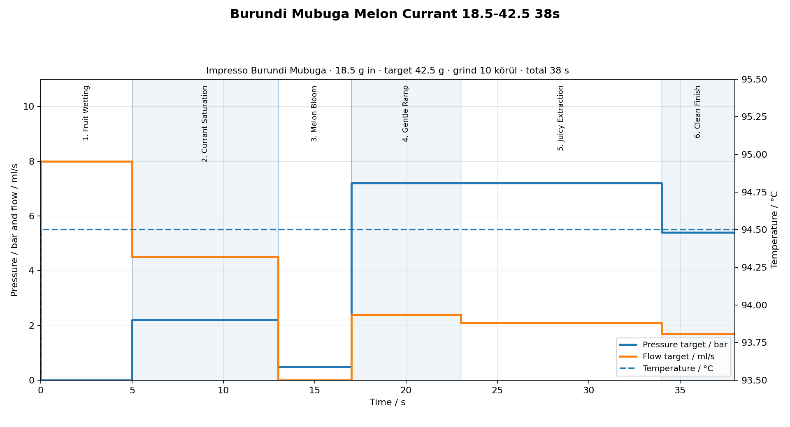

# Coffee Profiles V2 – Bluetooth Scale Edition

GaggiMate Pro JSON profilok grafikus előnézettel.

**Jelenlegi verzió:** V2 – Bluetooth Scale Edition (BOOKOO Themis Ultra aktív)

A JSON profilokat a GaggiMate Web UI-ban lehet importálni: **Profiles → Import**.

---

## Setup

- **Machine:** Gaggia Classic Pro 2025 + GaggiMate Pro
- **Grinder:** DF64V Gen 2
- **Burrs:** SSP Sweet Lab Espresso V3
- **Basket:** IMS B682TH24.5M
- **Puck screen:** IMS E&B Lab puck diffuser screen, Ø 2.4 mm, 253 holes (DS58.5)
- **RPM:** 1200 baseline
- **Grinder scale:** 0–90, egész jelölések
- **Scale:** BOOKOO Themis Ultra (Bluetooth, aktív)
- **Stop mód:** beverage weight (V2 profilok) / időalapú (V1 profilok)

---

## Aktív profilok – V1 (Time Based)

| Kávé | Profil | JSON | Grafikon | Recept |
|---|---|---|---|---|
| Impresso - Kenya Wangera | Stable Start 38s 94.5C | [`wangera-manual-v2.json`](profiles/wangera/wangera-manual-v2.json) | [`wangera-profile.png`](profiles/wangera/wangera-profile.png) | [`wangera-recipe.md`](profiles/wangera/wangera-recipe.md) |
| Impresso - Burundi Mubuga | Melon Currant 38s | [`burundi-mubuga-manual.json`](profiles/burundi-mubuga/burundi-mubuga-manual.json) | [`burundi-mubuga-profile.png`](profiles/burundi-mubuga/burundi-mubuga-profile.png) | [`burundi-mubuga-recipe.md`](profiles/burundi-mubuga/burundi-mubuga-recipe.md) |
| Impresso - Colombia Manos Juntas | Jam Mango 39s | [`colombia-manos-juntas-manual.json`](profiles/colombia-manos-juntas/colombia-manos-juntas-manual.json) | [`colombia-manos-juntas-profile.png`](profiles/colombia-manos-juntas/colombia-manos-juntas-profile.png) | [`colombia-manos-juntas-recipe.md`](profiles/colombia-manos-juntas/colombia-manos-juntas-recipe.md) |
| Impresso - Kenya Kirinyaga PB | Tea Rose 37s | [`kirinyaga-manual.json`](profiles/kirinyaga/kirinyaga-manual.json) | [`kirinyaga-profile.png`](profiles/kirinyaga/kirinyaga-profile.png) | [`kirinyaga-recipe.md`](profiles/kirinyaga/kirinyaga-recipe.md) |
| 28 - Finca el Recreo Caturron | Flavor 42s | [`caturron-manual.json`](profiles/twenty-eight-caturron/caturron-manual.json) | [`twenty-eight-caturron-profile.png`](profiles/twenty-eight-caturron/twenty-eight-caturron-profile.png) | [`twenty-eight-caturron-recipe.md`](profiles/twenty-eight-caturron/twenty-eight-caturron-recipe.md) |
| Impresso - El Salvador Ochupse | Grape Rose 31s 93C | [`el-salvador-ochupse-manual.json`](profiles/el-salvador-ochupse/el-salvador-ochupse-manual.json) | [`el-salvador-ochupse-manual-profile.png`](profiles/el-salvador-ochupse/el-salvador-ochupse-manual-profile.png) | [`el-salvador-ochupse-recipe.md`](profiles/el-salvador-ochupse/el-salvador-ochupse-recipe.md) |

---

## Aktív profilok – V2 (Bluetooth Scale Edition)

| Kávé | V2 JSON | Target Yield | Safety Timeout |
|---|---|---:|---:|
| Impresso - Kenya Wangera | [`wangera-scale-v2.json`](profiles/wangera/wangera-scale-v2.json) | 42.0 g | 45 s |
| Impresso - Kenya Wangera (94.0 C) | [`wangera-scale-v1.json`](profiles/wangera/wangera-scale-v1.json) | 42.0 g | 45 s |
| Impresso - Burundi Mubuga | [`burundi-mubuga-scale.json`](profiles/burundi-mubuga/burundi-mubuga-scale.json) | 42.5 g | 45 s |
| Impresso - Colombia Manos Juntas | [`colombia-manos-juntas-scale.json`](profiles/colombia-manos-juntas/colombia-manos-juntas-scale.json) | 43.0 g | 47 s |
| Impresso - Kenya Kirinyaga PB | [`kirinyaga-scale.json`](profiles/kirinyaga/kirinyaga-scale.json) | 43.0 g | 45 s |
| 28 - Finca el Recreo Caturron | [`caturron-scale.json`](profiles/twenty-eight-caturron/caturron-scale.json) | 42.0 g | 50 s |
| Impresso - El Salvador Ochupse | [`el-salvador-ochupse-scale.json`](profiles/el-salvador-ochupse/el-salvador-ochupse-scale.json) | 41.0 g | 45 s |
| Impresso - Honduras Las Calaveras | [`honduras-las-calaveras-scale.json`](profiles/honduras-las-calaveras/honduras-las-calaveras-scale.json) | 39.0 g | 33 s |

---

## Általános (nem kávé-specifikus) profilok

| Profil | Leírás | JSON | Grafikon | Recept |
|---|---|---|---|---|
| 9 Bar Espresso | Klasszikus 9 baros baseline | [`profile-9bar.json`](profiles/9-bar/profile-9bar.json) | [`profile-9bar-profile.png`](profiles/9-bar/profile-9bar-profile.png) | [`9-bar-recipe.md`](profiles/9-bar/9-bar-recipe.md) |
| Cremina lever machine | Sötét pörkölésű, testes, édes, leveres espresso | [`profile-lever.json`](profiles/cremina-lever/profile-lever.json) | [`profile-lever-profile.png`](profiles/cremina-lever/profile-lever-profile.png) | [`cremina-lever-recipe.md`](profiles/cremina-lever/cremina-lever-recipe.md) |
| Damian's LM Leva | Modern specialty, világos-közepes pörköléshez | [`profile-lmleva.json`](profiles/damians-lm-leva/profile-lmleva.json) | [`profile-lmleva-profile.png`](profiles/damians-lm-leva/profile-lmleva-profile.png) | [`damians-lm-leva-recipe.md`](profiles/damians-lm-leva/damians-lm-leva-recipe.md) |
| Adaptive v2 | Univerzális, adaptív preinfusion, light-to-medium pörköléshez | [`profile-adapt.json`](profiles/adaptive-v2/profile-adapt.json) | [`profile-adapt-profile.png`](profiles/adaptive-v2/profile-adapt-profile.png) | [`adaptive-v2-recipe.md`](profiles/adaptive-v2/adaptive-v2-recipe.md) |

---

## Bluetooth Scale Edition

### Támogatott hardver

- **GaggiMate Pro** – espresso vezérlő Gaggia Classic Pro 2025 gépen
- **BOOKOO Themis Ultra** – Bluetooth espresso mérleg

### Bluetooth kapcsolat

A GaggiMate Pro a BOOKOO Themis Ultra mérleggel Bluetooth-on kommunikál. A párosítást a GaggiMate Web UI-ban kell elvégezni. Részletes leírás: [`BLUETOOTH_SCALE_WORKFLOW.md`](BLUETOOTH_SCALE_WORKFLOW.md)

### Automatikus shot stop

A V2 profilok beverage weight alapján állítják meg a shotot:

1. A mérleg méri a csészébe folyó kávé súlyát (beverage weight)
2. Amikor eléri a profil `stop_at_g` értékét, a GaggiMate Pro leállítja a pumpát
3. Ha a Bluetooth kapcsolat megszakad, a safety timeout lép életbe

### Stop workflow összehasonlítás

| | V1 (Time Based) | V2 (Scale Edition) |
|---|---|---|
| Shot stop | Időalapú (38-42 s) | Beverage weight (gramm) |
| Mérleg | Manuális figyelés | Automatikus Bluetooth stop |
| Konzisztencia | Variábilis (flow-függő) | Reprodukálható hozam |
| Fallback | Nincs | Safety timeout (45-50 s) |

### V2 workflow

1. Mérleg bekapcsolás és kalibráció (tare)
2. GaggiMate Web UI: Bluetooth mérleg csatlakoztatás
3. V2 profil betöltése és importálása
4. Portafilter behelyezése, csésze a mérlegre
5. Shot indítása – a GaggiMate automatikusan megáll a céltömegnél

Részletes workflow: [`BLUETOOTH_SCALE_WORKFLOW.md`](BLUETOOTH_SCALE_WORKFLOW.md)

### Firmware viselkedés (GaggiMate 1.8.1)

A `targets` tömb **fázis szintű** — minden phase-hez külön definiálható. A V2 profilok az extraction fázisba helyezik a `volumetric` target-et:

- A target minden 100 ms-ban kiértékelődik
- Ha a mért beverage weight eléri a beállított értéket, a fázis azonnal véget ér
- `pro` típusnál a `duration` mindig **hard cap** (safety fallback): ha a scale nem csatlakozik vagy a target nem tüzel, a duration zárja a fázist
- A `volumetric` target csak aktív Bluetooth scale + brew-by-weight mód esetén működik

---

## Galéria

### Wangera Stable Start 38s 94.5C


### Burundi Mubuga Melon Currant 38s



### Colombia Manos Juntas Jam Mango 39s


### Kirinyaga PB Tea Rose 37s


### 28 - Finca el Recreo Caturron Flavor 42s


---

## Grafikonok újragenerálása

A grafikonokat a `tools/render_gaggimate_profiles.py` generálja a JSON profilokból.

```bash
python3 tools/render_gaggimate_profiles.py
```

Egyetlen profilhoz:

```bash
python3 tools/render_gaggimate_profiles.py profiles/wangera/wangera-manual-v2.json
```

A script minden JSON mellé létrehozza / felülírja az egyedi nevű `*-profile.png` képet. A V2 JSON profilokhoz is generál grafikont.

---

## Az index.html katalógusa

Az `index.html` nem tartalmaz kézzel írt profilkártyákat: minden kártyát a `profiles/catalog.json`-ból épít fel futásidőben. A katalógust a `tools/build_catalog.py` generálja a `profiles/*` mappák tartalmából:

```bash
python3 tools/build_catalog.py            # profiles/catalog.json frissítése
python3 tools/build_catalog.py --check    # csak ellenőrzés, hiba esetén exit 1
```

Ez commitkor automatikusan lefut egy git pre-commit hook-on keresztül (a hook maga nincs git alatt verziózva, friss klónozás után újra kell telepíteni):

```bash
cp tools/git-hooks/pre-commit .git/hooks/pre-commit && chmod +x .git/hooks/pre-commit
```

Így egy új kávé mappa hozzáadásakor elég a JSON/PNG/recipe/changelog fájlokat elhelyezni — az `index.html`-hez nem kell hozzányúlni.

---

## Dokumentumok

| Fájl | Tartalom |
|---|---|
| [`BLUETOOTH_SCALE_WORKFLOW.md`](BLUETOOTH_SCALE_WORKFLOW.md) | Párosítás, kalibráció, shot workflow, troubleshooting |
| [`BREW_GUIDELINES.md`](BREW_GUIDELINES.md) | Dial-in, dózis, arány, hozam, shot értékelés |
| [`SUMMARY.md`](SUMMARY.md) | Összes profil összefoglalója |
| [`PROFILE_GALLERY.md`](PROFILE_GALLERY.md) | Profilgrafikonok galériája |
| [`FILE_NAMING.md`](FILE_NAMING.md) | Fájlelnevezési konvenció |
| [`CHANGELOG.md`](CHANGELOG.md) | Projekt szintű változásnapló |
| [`speciality_kave_feldolgozasok.md`](speciality_kave_feldolgozasok.md) | Kávé feldolgozási módszerek |
| [`equipment/setup.md`](equipment/setup.md) | Gép és daráló beállítások |
| [`kaveviz-5l-epsom-bikarbonat.md`](kaveviz-5l-epsom-bikarbonat.md) | Kávévíz recept 5 literes desztillált vízhez (Epsom-só + szódabikarbóna) |

---

## GitHub megjegyzés

A Markdownban relatív képhivatkozásokat használunk. Minden fájlnév egyedi (tartalmazza a profil nevét), így GitHub-ra gond nélkül feltölthető.
