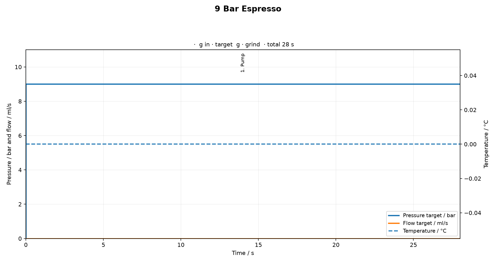
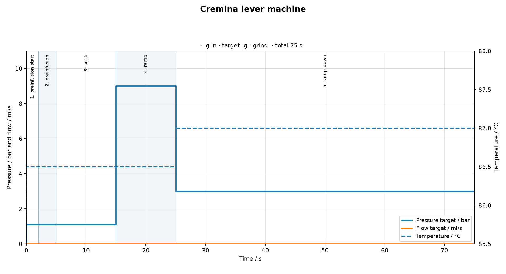
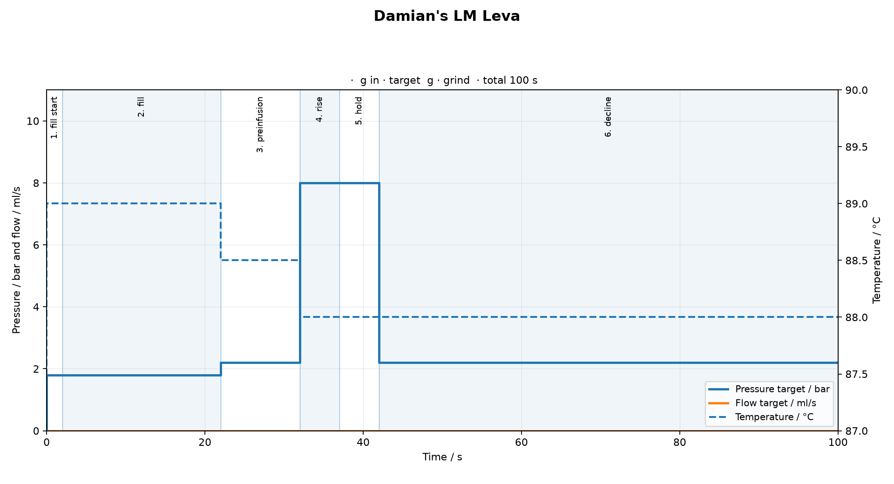
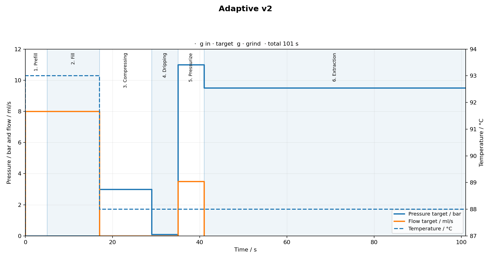
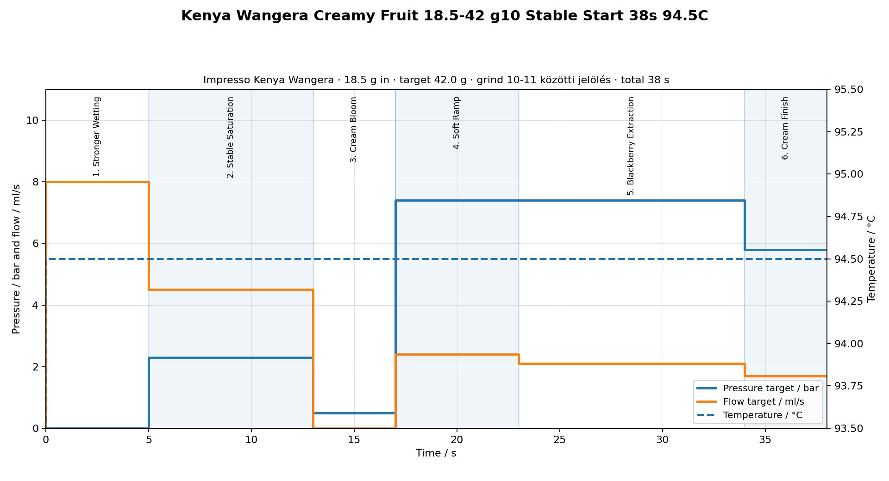
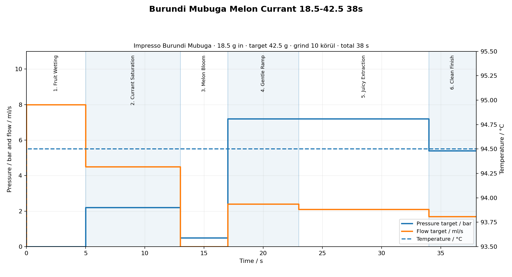
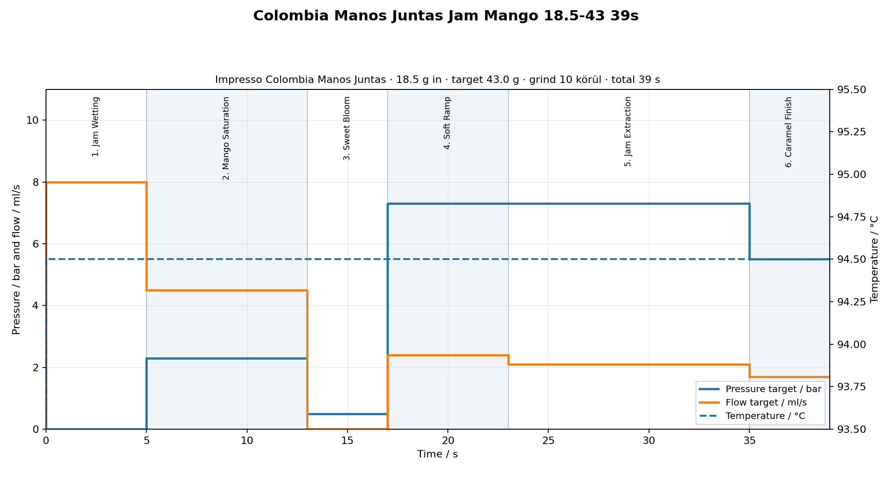
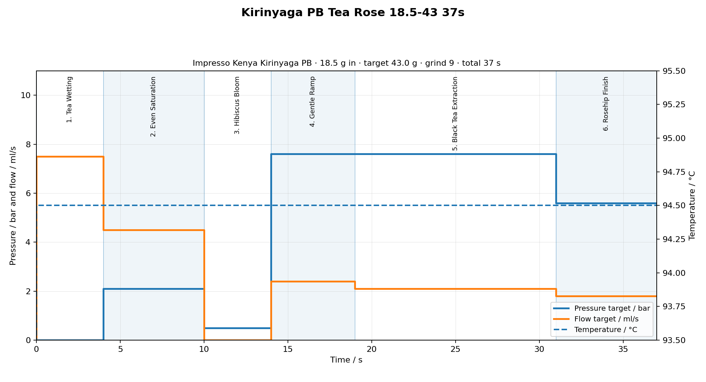
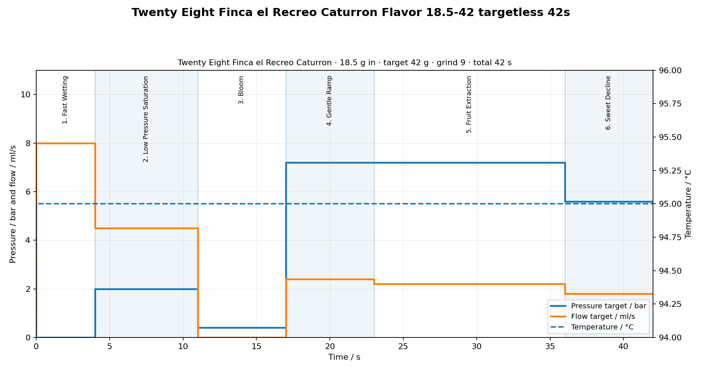

# GaggiMate Coffee Profiles V4 – Összefoglaló

**Verzió:** V4 – Bluetooth Scale Edition

**Gép:** Gaggia Classic Pro 2025 + GaggiMate Pro
**Daráló:** DF64V Gen 2 · SSP Sweet Lab Espresso V3 kések · 1200 RPM baseline
**Kosár:** IMS B682TH24.5M · Dózis: 18.5 g
**Puck screen:** IMS E&B Lab puck diffuser screen, Ø 2.4 mm, 253 lyuk (DS58.5)
**Mérleg:** BOOKOO Themis Ultra (Bluetooth, aktív)
**Stop mód:** beverage weight (V4) / időalapú fallback (V3)

---

## V4 Scale Edition profilok

| Kávé | Target Yield | Arány | Hő | Safety | V4 JSON |
|---|---:|---|---:|---:|---|
| Kenya Wangera | 42.0 g | 1:2.27 | 94.5 °C | 45 s | [wangera-stable-38s-945c-scale-v4.json](profiles/wangera/wangera-stable-38s-945c-scale-v4.json) |
| Kenya Wangera (94C) | 42.0 g | 1:2.27 | 94.0 °C | 45 s | [wangera-stable-38s-scale-v4.json](profiles/wangera/wangera-stable-38s-scale-v4.json) |
| Burundi Mubuga | 42.5 g | 1:2.30 | 94.5 °C | 45 s | [burundi-mubuga-38s-scale-v4.json](profiles/burundi-mubuga/burundi-mubuga-38s-scale-v4.json) |
| Colombia Manos Juntas | 43.0 g | 1:2.32 | 94.5 °C | 47 s | [colombia-manos-juntas-39s-scale-v4.json](profiles/colombia-manos-juntas/colombia-manos-juntas-39s-scale-v4.json) |
| Kenya Kirinyaga PB | 43.0 g | 1:2.32 | 94.5 °C | 45 s | [kirinyaga-tea-rose-37s-scale-v4.json](profiles/kirinyaga/kirinyaga-tea-rose-37s-scale-v4.json) |
| Twenty Eight Caturron | 42.0 g | 1:2.27 | 95.0 °C | 50 s | [caturron-flavor-42s-scale-v4.json](profiles/twenty-eight-caturron/caturron-flavor-42s-scale-v4.json) |

---

## Általános (nem kávé-specifikus) profilok

| Profil | Leírás | JSON | Recept |
|---|---|---|---|
| 9 Bar Espresso | Klasszikus 9 baros baseline | [profile-9bar.json](profiles/9-bar/profile-9bar.json) | [9-bar-recipe.md](profiles/9-bar/9-bar-recipe.md) |
| Cremina lever machine | Sötét pörkölésű, testes, édes, leveres espresso | [profile-lever.json](profiles/cremina-lever/profile-lever.json) | [cremina-lever-recipe.md](profiles/cremina-lever/cremina-lever-recipe.md) |
| Damian's LM Leva | Modern specialty, világos-közepes pörköléshez | [profile-lmleva.json](profiles/damians-lm-leva/profile-lmleva.json) | [damians-lm-leva-recipe.md](profiles/damians-lm-leva/damians-lm-leva-recipe.md) |
| Adaptive v2 | Univerzális, adaptív preinfusion, light-to-medium pörköléshez | [profile-adapt.json](profiles/adaptive-v2/profile-adapt.json) | [adaptive-v2-recipe.md](profiles/adaptive-v2/adaptive-v2-recipe.md) |

---

## V3 Time Based profilok (referencia)

| Kávé | Profil | Idő | Hő | Dózis | Célhozam | Őrlés | JSON | Recept |
|---|---|---:|---:|---:|---:|---:|---|---|
| Kenya Wangera | Stable Start | 38 s | 94.5 °C | 18.5 g | 42 g | 10-11 | [wangera-stable-38s-945c.json](profiles/wangera/wangera-stable-38s-945c.json) | [wangera-recipe.md](profiles/wangera/wangera-recipe.md) |
| Burundi Mubuga | Melon Currant | 38 s | 94.5 °C | 18.5 g | 42.5 g | 10-11 | [burundi-mubuga-38s.json](profiles/burundi-mubuga/burundi-mubuga-38s.json) | [burundi-mubuga-recipe.md](profiles/burundi-mubuga/burundi-mubuga-recipe.md) |
| Colombia Manos Juntas | Jam Mango | 39 s | 94.5 °C | 18.5 g | 43 g | 10-11 | [colombia-manos-juntas-39s.json](profiles/colombia-manos-juntas/colombia-manos-juntas-39s.json) | [colombia-manos-juntas-recipe.md](profiles/colombia-manos-juntas/colombia-manos-juntas-recipe.md) |
| Kenya Kirinyaga PB | Tea Rose | 37 s | 94.5 °C | 18.5 g | 43 g | 9-10 | [kirinyaga-tea-rose-37s.json](profiles/kirinyaga/kirinyaga-tea-rose-37s.json) | [kirinyaga-recipe.md](profiles/kirinyaga/kirinyaga-recipe.md) |
| Twenty Eight Caturron | Flavor | 42 s | 95 °C | 18.5 g | 42 g | 8-10 | [caturron-flavor-42s.json](profiles/twenty-eight-caturron/caturron-flavor-42s.json) | [twenty-eight-caturron-recipe.md](profiles/twenty-eight-caturron/twenty-eight-caturron-recipe.md) |

---

## Ízprofilok

| Kávé | Feldolgozás | Ízjegyek |
|---|---|---|
| Kenya Wangera | washed | szeder · tejszín · pomelo |
| Burundi Mubuga | natural | sárgadinnye · alma · ribizli |
| Colombia Manos Juntas | anaerobic natural | vörösáfonya dzsem · karamell · mangó |
| Kenya Kirinyaga PB | washed | hibiszkusz · csipkebogyó · fekete tea |
| Twenty Eight Caturron | natural | meggy · konyakmeggy · piros gyümölcs · bonbonos édesség |

---

## Általános profilgrafikonok

### 9 Bar Espresso



### Cremina lever machine



### Damian's LM Leva



### Adaptive v2



---

## V3 Profilgrafikonok

### Kenya Wangera – Stable Start 38s 94.5C



### Burundi Mubuga – Melon Currant 38s



### Colombia Manos Juntas – Jam Mango 39s



### Kenya Kirinyaga PB – Tea Rose 37s



### Twenty Eight Caturron – Flavor 42s



---

## Könyvtárszerkezet

```
profiles/
├── wangera/
│   ├── wangera-stable-38s-945c.json          ← V3 időalapú profil
│   ├── wangera-stable-38s.json               ← V3 időalapú profil (94.0C)
│   ├── wangera-stable-38s-945c-scale-v4.json ← V4 Scale Edition (94.5C)
│   ├── wangera-stable-38s-scale-v4.json      ← V4 Scale Edition (94.0C)
│   ├── wangera-profile.png                   ← V3 grafikon
│   ├── wangera-recipe.md                     ← recept (V3 + V4 szakasz)
│   └── wangera-changelog.md
├── burundi-mubuga/
│   ├── burundi-mubuga-38s.json
│   ├── burundi-mubuga-38s-scale-v4.json
│   ├── burundi-mubuga-profile.png
│   ├── burundi-mubuga-recipe.md
│   └── burundi-mubuga-changelog.md
├── colombia-manos-juntas/
│   ├── colombia-manos-juntas-39s.json
│   ├── colombia-manos-juntas-39s-scale-v4.json
│   ├── colombia-manos-juntas-profile.png
│   ├── colombia-manos-juntas-recipe.md
│   └── colombia-manos-juntas-changelog.md
├── kirinyaga/
│   ├── kirinyaga-tea-rose-37s.json
│   ├── kirinyaga-37s.json
│   ├── kirinyaga-tea-rose-37s-scale-v4.json
│   ├── kirinyaga-37s-scale-v4.json
│   ├── kirinyaga-profile.png
│   ├── kirinyaga-recipe.md
│   └── kirinyaga-changelog.md
├── twenty-eight-caturron/
│   ├── caturron-flavor-42s.json
│   ├── caturron-flavor-42s-scale-v4.json
│   ├── twenty-eight-caturron-profile.png
│   ├── twenty-eight-caturron-recipe.md
│   └── twenty-eight-caturron-changelog.md
├── 9-bar/
│   ├── profile-9bar.json
│   ├── 9-bar-recipe.md
│   └── 9-bar-changelog.md
├── cremina-lever/
│   ├── profile-lever.json
│   ├── cremina-lever-recipe.md
│   └── cremina-lever-changelog.md
├── damians-lm-leva/
│   ├── profile-lmleva.json
│   ├── damians-lm-leva-recipe.md
│   └── damians-lm-leva-changelog.md
├── adaptive-v2/
│   ├── profile-adapt.json
│   ├── adaptive-v2-recipe.md
│   └── adaptive-v2-changelog.md
equipment/
└── setup.md
templates/
├── recipe-template.md
├── shot-log-template.md
└── changelog-template.md
tools/
└── render_profiles.py
```

---

## Dokumentumok

| Fájl | Tartalom |
|---|---|
| [README.md](README.md) | Projekt áttekintő, profilok táblázata, Bluetooth Scale Edition leírás |
| [BLUETOOTH_SCALE_WORKFLOW.md](BLUETOOTH_SCALE_WORKFLOW.md) | Párosítás, kalibráció, shot workflow, troubleshooting |
| [BREW_GUIDELINES.md](BREW_GUIDELINES.md) | Dial-in irányelvek, dózis, arány, hozam, shot értékelés |
| [PROFILE_GALLERY.md](PROFILE_GALLERY.md) | V3 és V4 profilgrafikonok galériája |
| [FILE_NAMING.md](FILE_NAMING.md) | Fájlelnevezési konvenció |
| [CHANGELOG.md](CHANGELOG.md) | Projekt szintű változásnapló |
| [speciality_kave_feldolgozasok.md](speciality_kave_feldolgozasok.md) | Kávé feldolgozási módszerek |
| [equipment/setup.md](equipment/setup.md) | Gép és daráló beállítások |

---

## Grafikonok újragenerálása

```bash
# Összes profil (V3 és V4 egyaránt)
python3 tools/render_profiles.py

# Egyetlen profil
python3 tools/render_profiles.py profiles/wangera/wangera-stable-38s-945c.json
python3 tools/render_profiles.py profiles/wangera/wangera-stable-38s-945c-scale-v4.json
```

A script a JSON neve alapján generálja a PNG-t: `{json-stem}-profile.png`.

---

## JSON import

A JSON profilokat (V3 és V4 egyaránt) a GaggiMate Web UI-ban lehet importálni: **Profiles → Import**.
